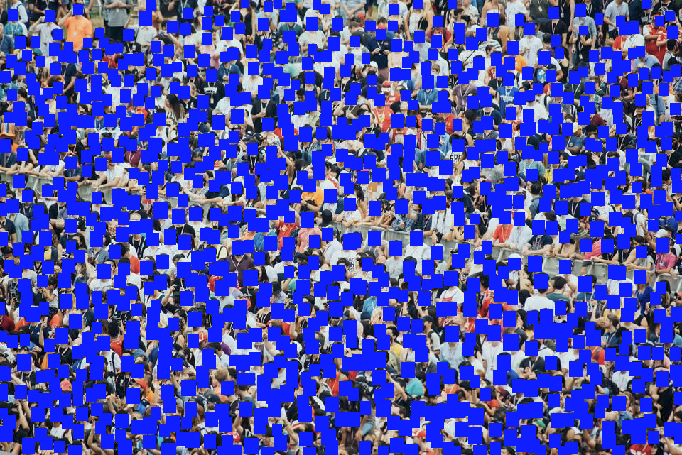

# DFACE.app



[DFACE.app](https://dface.app) is a web application that performs high quality face redaction in a web browser using YOLOv5 computer vision models and Tensorflow.js. Made by VFRAME.io.


## Environment Setup

- Install NVM from https://github.com/nvm-sh/nvm

```bash
nvm use node
nvm install 14.17.1
nvm use 14.17.1
```

- Install Yarn

```bash
npm install -g yarn
```

- Install dependencies

```bash
yarn install
```

- Disable Next.js telemetry:

```bash
npx next telemetry disable
```

## Development

Start a development server on http://localhost:3000/

```bash
yarn dev
```

Models should be placed in `public/assets/models/` in folders named identically to the names in `modelzoo.yaml`. The application will look for the file `model.json` when loading a model. The active models can be rebuilt from the YAML by running:

```bash
yarn modelzoo
```

### Emoji

Let's admit it, emoji are probably the most important part of this application. Here is how you can generate a test document of emoji so you can load more (using twemoji):

```bash
cd node_modules/twemoji-emojis/vendor/svg
echo "<style>div img { width: 48px; height: 48px; display: block; } div { display: inline-block; font-size: 12px; }</style>" >> emoji.html
for i in *.svg; do echo "<div>$i</div>" >> emoji.html; done
python3 -m http.server 8000
```

- Navigate to http://localhost:8000/emoji.html
- Emoji are listed in `components/common/Emoji.js`, follow the pattern to add new ones
- Emoji are grouped by classes. The list of classes should correspond to the emojiOptions in `constants/index.js`

## Deployment

This command will build the static site to the `out/` directory, suitable for deployment.

```bash
yarn build
```


## Credits

- DFACE uses the YOLOV5 object detection architecture by [Glenn Jocher](https://github.com/ultralytics/yolov5) based on the original [YOLO](https://arxiv.org/abs/1506.02640) by Joseph Redmon


## Acknowledgments

VFRAME gratefully acknowledges support from NLnet for the continued development of DFACE:


VFRAME received support from the NLNet Foundation and Next Generation Internet (NGI0) supported research and development of face blurring and biometric redaction tools during 2019 - 2021. Funding was provided through the NGI0 Privacy Enhancing Technologies Fund, a fund established by NLnet with financial support from the European Commission’s Next Generation Internet program. 


## Licenses

- DFACE web application [MIT](LICENSE)
- Next.js: [MIT](https://github.com/vercel/next.js/blob/canary/license.md)
- Tensorflow.js: [Apache 2.0](https://github.com/tensorflow/tfjs/blob/master/LICENSE)